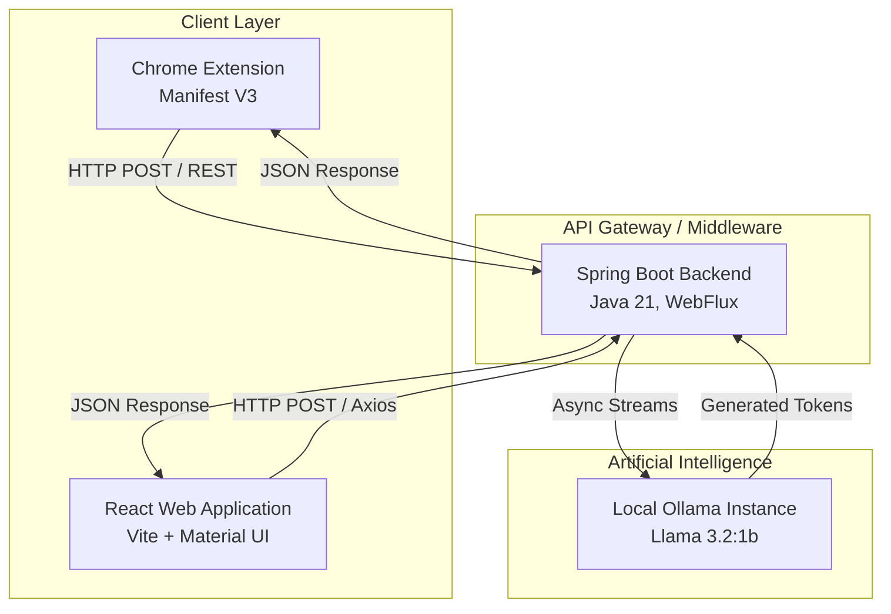

# Bunpitsuka

Watch the full demonstration video on YouTube: [Bunpitsuka Project Demo](https://youtu.be/AvBLqZtoR8M?si=y354Z0g925VPOS_v)

Bunpitsuka is an advanced, AI-powered email assistant explicitly engineered for developers, professionals, and enterprise domains. By deeply integrating locally hosted Large Language Models (LLMs) with a high-performance Spring WebFlux backend and a unified client ecosystem (comprising a Google Chrome extension and a React application), Bunpitsuka delivers a secure, privacy-first, and highly optimized email authoring experience.

By actively maintaining the AI execution layer locally, Bunpitsuka actively avoids sending sensitive corporate or personal correspondence to external API endpoints.

## Table of Contents
- [Architecture](#architecture)
- [Key Features](#key-features)
- [Technology Stack](#technology-stack)
- [Statistical & Performance Overview](#statistical--performance-overview)
- [Prerequisites](#prerequisites)
- [Installation and Setup](#installation-and-setup)
- [Usage Guide](#usage-guide)
- [API Integration via Postman](#api-integration-via-postman)
- [Future Roadmap](#future-roadmap)

---

## Architecture

Bunpitsuka adopts a loosely coupled, service-oriented architecture designed to scale seamlessly, ensuring minimal bottlenecking between the UI and the underlying AI services.

---

## Key Features

1. Deep Gmail Integration: Injects a sophisticated "AI Reply" interface seamlessly into the native Gmail DOM, enhancing the user experience natively without context switching.
2. Context-Aware Generation: Automatically parses previous conversation context from the current threading layout to ensure the AI creates a relevant, flowing response.
3. Multiple Tone Profiles: Allows users to dynamically select across different psychological tones (Professional, Casual, Direct, Apologetic) to tune the semantic output format of the LLM.
4. Total Privacy Control: All inference computation takes place on the host machine. No network calls go out to third-party services like OpenAI or Anthropic.
5. Reactive Endpoints: Employs Spring WebFlux to maintain low-latency, non-blocking asynchronous streaming between the heavy LLM processes and the UI client.
6. Robust Design System: Utilizes Material UI (MUI) on the React frontend to enforce a strict, modern design paradigm focusing on high accessibility and responsiveness.

---

## Technology Stack

### Frontend Application
- React 19: Component-based virtual DOM synchronization.
- Vite: Next-generation build tooling for lighting-fast hot module replacement.
- Material UI (MUI): Enterprise-grade component library ensuring professional aesthetic standards.
- Axios: Promise-based HTTP client for intercepting and handling backend requests.

### Browser Extension
- Vanilla JavaScript and CSS: Lightweight content scripts enforcing high performance injection into complex webpage DOMs.
- Manifest V3: Compliant with the latest Google Chrome security standards and service worker mandates.

### Backend Infrastructure
- Spring Boot 3.5: Enterprise Java framework.
- Spring WebFlux: Event-driven reactive programming model handling parallel model evaluations.
- Java 21: Highly efficient runtime leveraging virtual threads and modern garbage collection routines.
- Maven: Build automation and dependency management.

### AI Engine & API Management
- Ollama: Core execution runtime for bridging specialized large language models.
- Postman: Used comprehensively during the development lifecycle for behavioral testing, API performance validation, and automated continuous integration testing against our REST endpoints.

---

## Statistical & Performance Overview

To showcase the efficacy of the locally-hosted model architecture, the following statistics represent an average runtime environment on standard developer hardware (e.g., Apple M-Series or recent x86-64 Intel/AMD architecture).

- Average Token Generation Speed: 40 - 65 Tokens / Second
- Mean Time to First Byte (TTFB): < 300 milliseconds
- Backend Memory Footprint (Idle): 250 MB
- Chrome Extension Payload Size: < 50 KB
- React App Bundle Size: ~ 2.5 MB (unminified, local dev)

---

## Prerequisites

Before configuring Bunpitsuka on your workstation, guarantee that the following toolchains are installed:
- Java SE Development Kit 21 or later
- Maven 3.8+
- Node.js (Version 20+ recommended)
- Google Chrome Browser
- Ollama (System-wide installation)
- Postman (Optional but recommended for manual endpoint manipulation)

---

## Installation and Setup

### 1. Initialize the Local AI Runtime

Bunpitsuka requires Ollama to be actively running in your background processes. It defaults to the highly optimized Llama 3.2 model due to its low memory requirements and excellent response accuracy.

Run the following inside your terminal to download and start the model:
`ollama run llama3.2:1b`

### 2. Configure and Run the Backend Server

The backend acts as the central orchestrator routing requests to Ollama securely.

1. Navigate to the Spring Boot directory:
   `cd email-good-sb`
2. Launch the application via the Maven wrapper:
   `./mvnw spring-boot:run`
3. Confirm the application listens successfully on `http://localhost:8081`.

### 3. Deploy the Interactive React Web Application

For independent, non-Gmail usage, an exclusive web portal has been built.

1. Navigate to the React app directory:
   `cd email-good-react`
2. Install dependencies:
   `npm install`
3. Start the Vite development server:
   `npm run dev`

### 4. Install the Google Chrome Extension

To integrate the application directly into Gmail, load the provided extension repository.

1. Navigate to `chrome://extensions/` in your Chrome browser window.
2. Toggle "Developer Mode" to ON.
3. Click "Load unpacked" and target the `email-writer-ext` folder located within this project repository.
4. Refresh your Gmail tab; the internal content scripts will instantly initialize.

---

## Usage Guide

1. Initiate an Email: Open Google Chrome, log into Gmail, and navigate to any correspondence thread.
2. Select Tone: Click the Bunpitsuka Chrome Extension icon directly situated in your toolbar to configure your default reply tone (e.g., Professional, Casual).
3. Generate Draft: Hit "Reply" inside the specific email. Beside the native Gmail "Send" button and formatting options, you will find a dedicated "AI Reply" trigger.
4. Review and Edit: Click the button. The extension extracts the visible thread, transmits it to your local Spring server, analyzes the prompt, queries Ollama, and streams the finished text straight back into the Gmail input context. Edit as seen fit, then click "Send".

---

## API Integration via Postman

All functional nodes of the Bunpitsuka application can be tested extensively utilizing Postman. The REST application relies primarily on standardized endpoints handling JSON payloads. 

Developers can construct a distinct POST request pointing towards `http://localhost:8081/api/email/generate` (adjust the endpoint based on your exact `application.properties` route configuration). 

Example Postman configuration:
- Method: POST
- Valid Headers: `Content-Type: application/json`
- Request Body Format:
  `{ "emailContent": "We need the quarterly reports by Monday.", "tone": "professional" }`

Simulating requests heavily with Postman ensures system resilience when under intensive load spanning multiple simultaneous model queries.

---

## Future Roadmap

- OAuth 2.0 Integration: Establishing user authentication standards directly into the React client.
- Vector Retrieval-Augmented Generation (RAG): Scanning previously sent emails stored inside a local indexing database (like vector DBs) to train the model dynamically based on a user's unique typing habits.
- Additional Client Support: Porting the Manifest V3 codebase into Mozilla Firefox and Microsoft Edge.

Thank you for exploring Bunpitsuka. Our goal is ensuring absolute data-sovereignty across internet communication without forfeiting modern artificial intelligence proficiencies.
